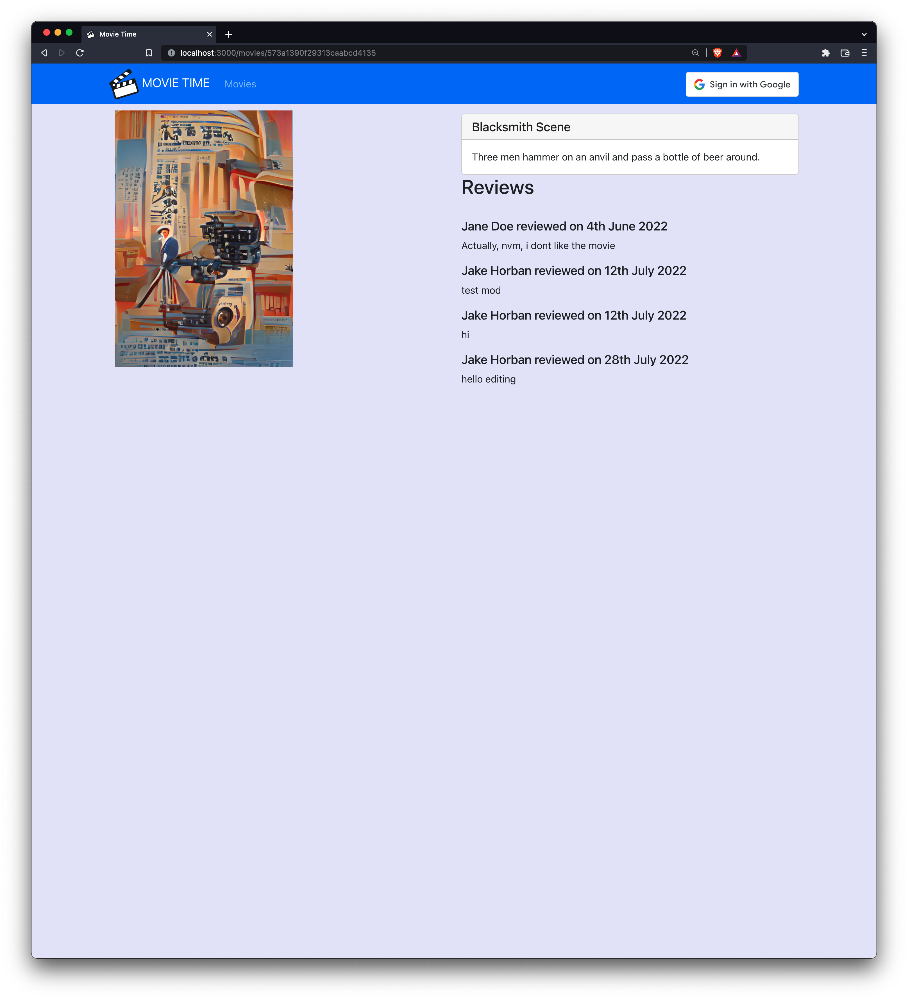
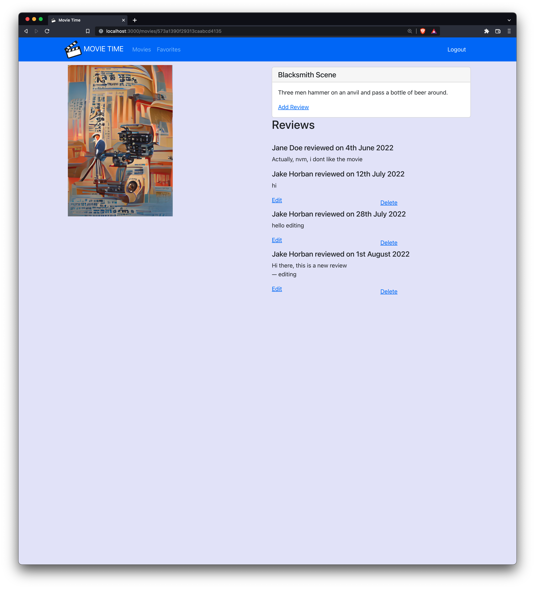
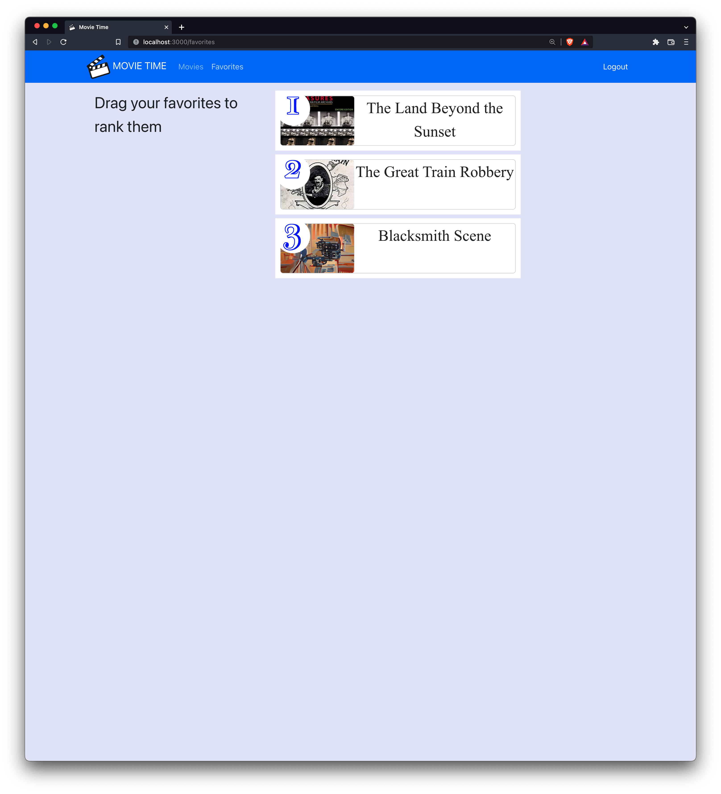

# Yevhen Horban Frontend

This web application is hosted on [Heroku](https://movietime-frontend-yhorban.herokuapp.com/)

## Public information

The home page of the application is showing 20 movies at the time along with the links to their reviews. 
At the bottom of the page there is a link that brings the users to the next page of movies.

## Search Movies

One could also search the movie database by title or by rating.

## Logged in users

When the users login with a google account additional functionality becomes available to them. 
They can mark the movies as favorites by clicking on the yellow start. 
Their marking is saved to the database.

Logged in users now have an ability to post new reviews and modify or delete their existing reviews.

There is now an additional 'Favorites' section in the navigation bar. 
On that page all the user's favorite movies appear in the order they were added 
unless the user rearranged them by dragging and dropping them. 

## Future ideas:
- improving search: use a Search engine like Solr to match both title and description, search by title and genre at the same time and sort the results based on the cosine similarity of the users favorite movies, display the number of movies found

## Latest project iterations
- New Favorites page and the ability to sort favorite movies by dragging and dropping them.